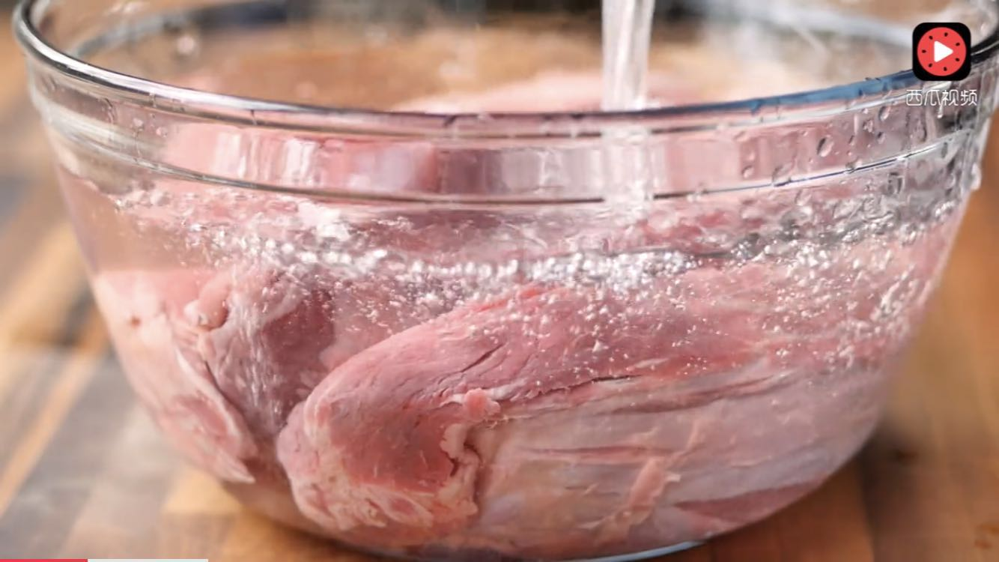
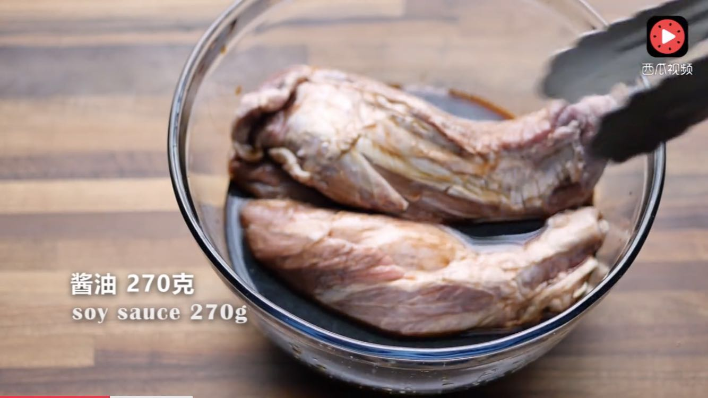
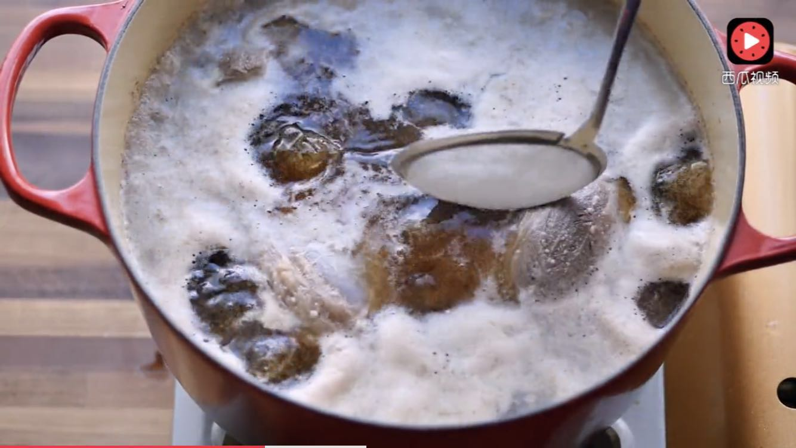
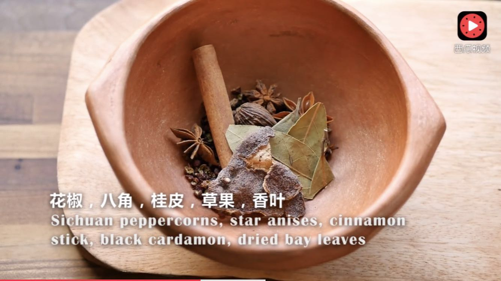
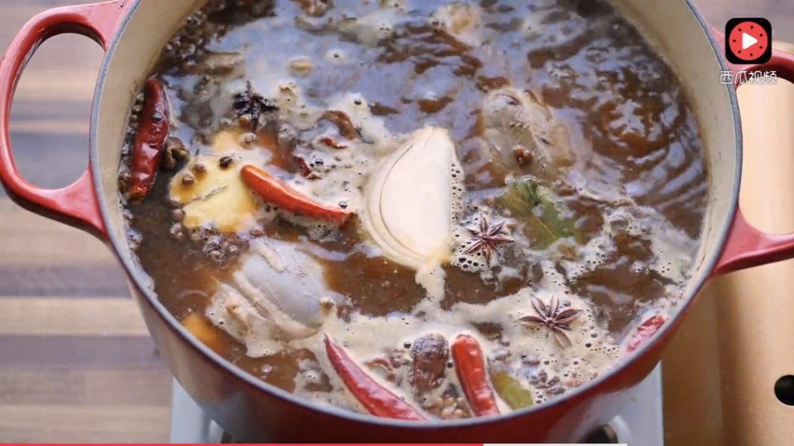

# 酱牛肉做法

生平就好一口牛肉，喜欢探索各种牛肉的做法，周末偶然发现了做酱牛肉的良方，试了试回味无穷。做法很简单。

### 1.选择**牛腱肉**，凉水浸泡三个小时，泡除血水。

### 2.倒入适量酱油，封上保鲜膜，放冰箱过夜。

### 3.辛苦等了一夜，终于可以开搞了。将酱牛肉放入锅里，把酱油也倒入锅里，加凉水，没过牛肉，开火煮开后打去白色浮沫。

### 4.打去白色浮沫后，加入花椒，八角，桂皮，香果，香叶，姜片，喜欢吃辣的也可以加点干辣椒

### 5.还要加入一块豆腐乳，适量甜面酱，少量盐。

### 6.**小火**炖2个半小时，一定要小火，似开未开的那种火，火太大会把牛肉弄碎。

### 7.关火之后，不要盛出来，要等它自然凉透，凉透后放入冰箱冷藏一段时间，就可以吃了。

**这么做味道真的超级棒，煮完的汤可以下个面条，做个米线之类的。最后感谢西瓜视频的 *小高姐***
